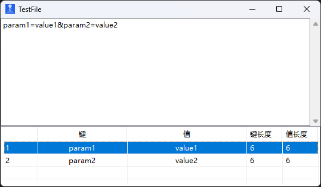

# HttpDataViewer

## 项目简介
HttpDataViewer 是一款轻量级、高效的数据解析和可视化工具，专为开发人员和测试工程师设计。它能够快速解析URL查询字符串、HTTP请求头和Cookies字符串，并以结构化表格形式展示，支持复制、修改、排序和文件操作，极大提升开发和调试效率。

## 程序界面预览

## 功能特性

1. **三格式解析** - 自动识别并解析URL查询字符串、HTTP请求头和Cookies字符串
2. **即时解析** - 输入或粘贴内容后立即解析并展示键值对
3. **结构化展示** - 以表格形式展示序号、键、值、键长度、值长度
4. **点击排序** - 点击列名可按键、值或各自长度进行升序/降序排序
5. **右键操作** - 通过上下文菜单支持复制单元格内容和修改值
6. **文件管理** - 使用.qsv文件格式保存、打开和导出解析数据
7. **性能优化** - 使用自定义SuperListView类实现双缓冲，提升大数据量下的显示性能
8. **线程安全** - 使用CancellationToken避免快速输入时出现的重复显示问题
9. **窗口定制** - 支持窗口置顶功能和自定义窗口标题
10. **多窗口支持** - 可同时打开多个应用实例处理不同的解析任务

## 如何使用

1. 下载并运行程序
2. 在顶部文本框中输入或粘贴URL查询字符串（格式：key1=value1&key2=value2）、HTTP请求头或Cookies字符串（格式：key1=value1; key2=value2）
3. 系统会自动识别格式并解析内容
4. 结果将显示在下方表格中，包含序号、键、值、键长度和值长度
5. 点击表格列名可对数据进行升序或降序排序
6. 右键点击表格中的单元格可以复制内容或修改值
7. 使用菜单保存工作、打开已保存的文件、固定窗口或创建新窗口

## 安装说明

1. 确保您的电脑已安装 [.NET 8.0 或更高版本](https://dotnet.microsoft.com/download/dotnet/8.0)
2. 从GitHub下载最新的发布版本
3. 解压文件并运行 HttpDataViewer.exe

## 技术栈
- C#
- .NET 8.0
- Windows Forms

## 开发说明

如果您想参与开发，可以按照以下步骤操作：
1. 克隆代码仓库
2. 使用Visual Studio 2022或更高版本打开解决方案
3. 进行开发和调试
4. 提交Pull Request

## 许可证
本项目采用 MIT 许可证 - 详见 [LICENSE](LICENSE) 文件

## 贡献
欢迎提交问题和建议，帮助我们改进这个工具！

## 多语言支持
此项目支持多语言文档，您可以查看以下版本：
- [README_EN.md](README_EN.md) - English (英文)