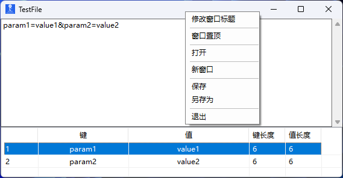

# HttpDataViewer

## Project Introduction
HttpDataViewer is a lightweight, efficient data parsing and visualization tool designed for developers and testers. It can quickly parse URL query strings, HTTP request headers, and Cookies strings, displaying them in a structured table format with support for copying, modification, sorting, and file operations, greatly improving development and debugging efficiency.

## Program Interface Preview

## Features

1. **Triple Format Parsing** - Automatically recognize and parse URL query strings, HTTP request headers, and Cookies strings
2. **Real-time Parsing** - Instantly parse and display key-value pairs as you type or paste
3. **Structured Display** - Show serial number, key, value, key length, value length in table format
4. **Click Sorting** - Click column headers to sort by key, value, or respective lengths in ascending/descending order
5. **Right-click Operations** - Support copying cell content and modifying values through context menus
6. **File Management** - Save, open, and export parsed data with .qsv file format
7. **Performance Optimization** - Use custom SuperListView class with double buffering to improve display performance with large data
8. **Thread Safety** - Use CancellationToken to avoid duplicate display issues during rapid input
9. **Window Customization** - Support window always-on-top feature and custom window titles
10. **Multi-window Support** - Open multiple instances of the application simultaneously for different parsing tasks

## How to Use

1. Download and run the program
2. Enter or paste a URL query string (format: key1=value1&key2=value2), HTTP request headers, or Cookies string (format: key1=value1; key2=value2) in the top text box
3. The system will automatically recognize the format and parse the content
4. Results will be displayed in the table below with serial number, key, value, key length, and value length
5. Click on table column headers to sort data in ascending or descending order
6. Right-click on cells in the table to copy content or modify values
7. Use the menu to save your work, open saved files, pin the window, or create new windows

## Installation

1. Ensure your computer has [.NET 8.0 or higher](https://dotnet.microsoft.com/download/dotnet/8.0) installed
2. Download the latest release from GitHub
3. Unzip the files and run HttpDataViewer.exe

## Tech Stack
- C#
- .NET 8.0
- Windows Forms

## Development

If you want to participate in development, you can follow these steps:
1. Clone the code repository
2. Open the solution with Visual Studio 2022 or higher
3. Develop and debug
4. Submit a Pull Request

## License
This project is licensed under the MIT License - see the [LICENSE](LICENSE) file for details

## Contributions
Contributions are welcome! Please submit issues and suggestions to help us improve this tool!

## Multi-language Support
This project supports multi-language documentation. You can view the following translations:
- [README.md](README.md) - Chinese Simplified (简体中文)